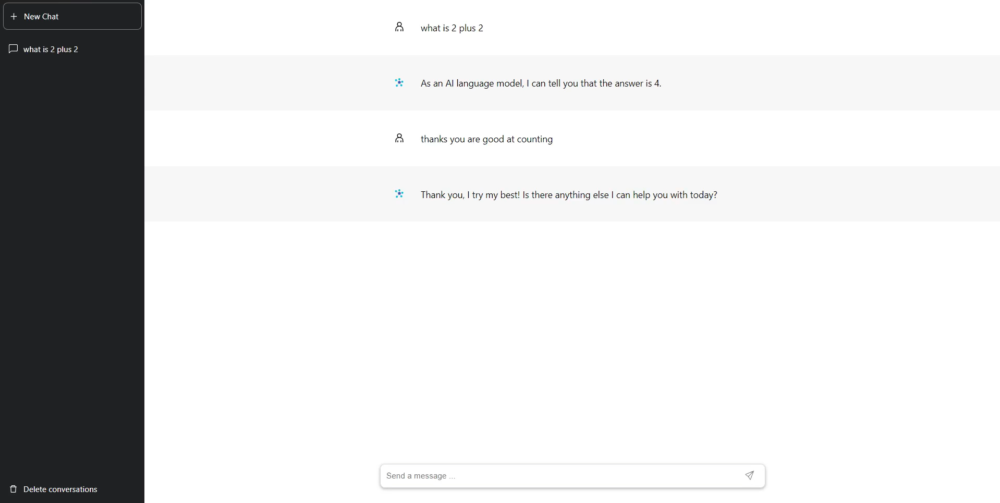

# ChatGPT Clone 🤖



A **full-stack ChatGPT clone** built with **React**, **Vite**, and **Node.js**, featuring real-time chat, modern UI, and scalable architecture.

## 🔍 Description

This project replicates the core features of ChatGPT, including multi-conversation chat, message streaming, and persistent history. It is split into two main parts:

- **Client**: Built with **React** and **Vite**
- **Server**: Built with **Node.js** and **Socket.io**

## 📁 Project Structure

```
.
├── client/   # React + Vite frontend
└── server/   # Node.js backend (Socket.io)
```

## 🚀 Features

- **Real-time chat** powered by Socket.io
- **Multi-conversation support**
- **Persistent chat history**
- **Loading spinner and feedback UI**
- **Modern, responsive design**
- **Conversation management** (create, delete)

## 🛠️ Tech Stack

### Frontend

- **React 18**
- **Vite**
- **Redux Toolkit** (state management)
- **Socket.io-client**
- **CSS Modules**

### Backend

- **Node.js**
- **Socket.io**
- **Express**

## ⚙️ Installation

### 1. Clone the Repo

```bash
git clone https://github.com/andrew-dev-p/chatgpt-clone
cd chatgpt-clone
```

### 2. Setup Client

```bash
cd client
npm install
```

### 3. Setup Server

```bash
cd ../server
npm install
```

## 🧪 Running Locally

### Client

```bash
cd client
npm run dev
```

### Server

```bash
cd server
npm start
```

## 🔐 Environment Variables

### 🔧 Server (`server/.env`)

```
# Add your OpenAI API key here
```

Feel free to customize and extend this project for your own AI chat applications!
